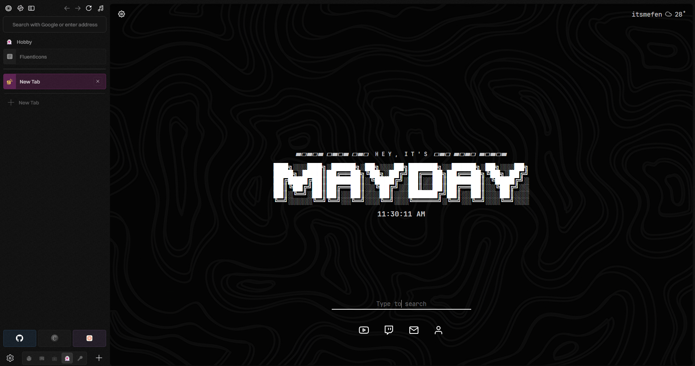

# Zen-Theme

## 💾 Prerequisite

> [!WARNING]
> Only Works on Zen Twilight and might break on other builds.

Enable them for a better experience/aesthetics.

| Features   | Details                  | Links                                             |
| ---        | -------------            | -------------                                     |
| Font       | `Switzer`                | [Switzer](https://www.fontshare.com/?q=Switzer)   |
| Extensions | `Tabnine`                | [Tabnine](https://addons.mozilla.org/en-US/firefox/addon/tab-nine/?utm_source=addons.mozilla.org&utm_medium=referral&utm_content=search)|
| Zen Mods   | `Superpins`              |                                                   |
| Zen Mods   | `Bottom Essentials`      |                                                   |
| Zen Mods   | `Old Navigation Buttons` |                                                   |
| Zen Mods   | `Better Unloaded Tabs`   |                                                   |

## ✨ Features

| Features                                                                                              	    | Preview 	|
|-------------------------------------------------------------------------------------------------------	    |---------	|
| **Cleaner Tab**                                                                                           	||
| **Workspace Indicator** - Shown on `selected tabs` & `media`                                          	|         	|
| **Sleek Playing/Mute Indicator**    - Animated Icons    - `Playing` : Coloured    - `Mute` : Dim 	|         	|
| **Coloured Essentials**                                                                                   	|         	|
| **Compact URL Bars**    - Thinner URL Bars    - Scrollable actionmedia                              	|         	|

## 🐞 Known Bugs / Work in Progress
- `Coloured Essentials` : Having per-workspace essentials messed up the colour positioning
